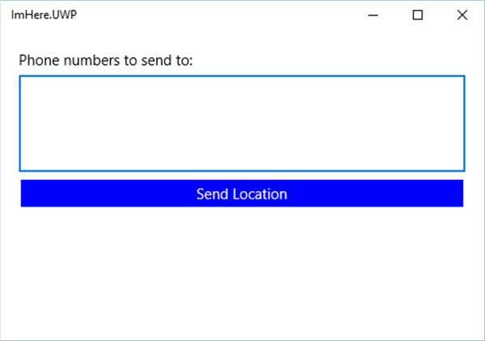

<span data-ttu-id="1b3c5-101">在这种情况下, 移动应用是一个简单的 "Hello World" 应用。</span><span class="sxs-lookup"><span data-stu-id="1b3c5-101">At this point, the mobile app is a simple "Hello World" app.</span></span> <span data-ttu-id="1b3c5-102">在此单元中, 添加 UI 和一些基本的应用程序逻辑。</span><span class="sxs-lookup"><span data-stu-id="1b3c5-102">In this unit, you add the UI and some basic application logic.</span></span>

<span data-ttu-id="1b3c5-103">应用程序的 UI 将包含以下内容:</span><span class="sxs-lookup"><span data-stu-id="1b3c5-103">The UI for the app will consist of:</span></span>

- <span data-ttu-id="1b3c5-104">一个用于输入一些电话号码的文本输入控件。</span><span class="sxs-lookup"><span data-stu-id="1b3c5-104">A text-entry control to enter some phone numbers.</span></span>
- <span data-ttu-id="1b3c5-105">一个按钮, 用于使用 Azure 函数将你的位置发送给这些号码。</span><span class="sxs-lookup"><span data-stu-id="1b3c5-105">A button to send your location to those numbers using an Azure function.</span></span>
- <span data-ttu-id="1b3c5-106">将向当前状态的用户显示邮件的标签, 如发送的位置和成功发送的位置。</span><span class="sxs-lookup"><span data-stu-id="1b3c5-106">A label that will show a message to the user of the current status, such as the location being sent and location sent successfully.</span></span>

<span data-ttu-id="1b3c5-107">Xamarin 支持称为 "模型-视图-ViewModel (MVVM)" 的设计模式。</span><span class="sxs-lookup"><span data-stu-id="1b3c5-107">Xamarin.Forms supports a design pattern called Model-View-ViewModel (MVVM).</span></span> <span data-ttu-id="1b3c5-108">您可以在[Xamarin MVVM 文档](https://docs.microsoft.com/xamarin/xamarin-forms/enterprise-application-patterns/mvvm?azure-portal=true)中了解有关 MVVM 的更多信息, 但它的本质是, 每个页面 (视图) 都有一个公开属性和行为的 ViewModel。</span><span class="sxs-lookup"><span data-stu-id="1b3c5-108">You can read more about MVVM in the [Xamarin MVVM docs](https://docs.microsoft.com/xamarin/xamarin-forms/enterprise-application-patterns/mvvm?azure-portal=true), but the essence of it is, each page (View) has a ViewModel that exposes properties and behavior.</span></span>

<span data-ttu-id="1b3c5-109">ViewModel 属性是按名称 "绑定" 到 UI 上的组件, 此绑定可同步视图和 ViewModel 之间的数据。</span><span class="sxs-lookup"><span data-stu-id="1b3c5-109">ViewModel properties are 'bound' to components on the UI by name, and this binding synchronizes data between the View and ViewModel.</span></span> <span data-ttu-id="1b3c5-110">例如, 名`string` `Name`为的 ViewModel 上的属性可以绑定到 UI 上`Text`的文本输入控件的属性。</span><span class="sxs-lookup"><span data-stu-id="1b3c5-110">For example, a `string` property on a ViewModel called `Name` could be bound to the `Text` property of a text-entry control on the UI.</span></span> <span data-ttu-id="1b3c5-111">文本输入控件显示`Name`属性中的值, 当用户更改 UI 中的文本时, 将`Name`更新属性。</span><span class="sxs-lookup"><span data-stu-id="1b3c5-111">The text-entry control shows the value in the `Name` property and, when the user changes the text in the UI, the `Name` property is updated.</span></span> <span data-ttu-id="1b3c5-112">如果在 ViewModel 中更改`Name`了属性的值, 则会引发一个事件来通知 UI 进行更新。</span><span class="sxs-lookup"><span data-stu-id="1b3c5-112">If the value of the `Name` property is changed in the ViewModel, an event is raised to tell the UI to update.</span></span>

<span data-ttu-id="1b3c5-113">ViewModel 行为公开为命令属性, 该命令是一个包装在调用命令时执行的操作的对象。</span><span class="sxs-lookup"><span data-stu-id="1b3c5-113">ViewModel behavior is exposed as command properties, a command being an object that wraps an action that is executed when the command is invoked.</span></span> <span data-ttu-id="1b3c5-114">这些命令按名称绑定到类似按钮的控件, 点击按钮将调用命令。</span><span class="sxs-lookup"><span data-stu-id="1b3c5-114">These commands are bound by name to controls like buttons, and tapping a button will invoke the command.</span></span>

## <a name="create-a-base-viewmodel"></a><span data-ttu-id="1b3c5-115">创建基本 ViewModel</span><span class="sxs-lookup"><span data-stu-id="1b3c5-115">Create a base ViewModel</span></span>

<span data-ttu-id="1b3c5-116">ViewModels 所有实现`INotifyPropertyChanged`接口。</span><span class="sxs-lookup"><span data-stu-id="1b3c5-116">ViewModels all implement the `INotifyPropertyChanged` interface.</span></span> <span data-ttu-id="1b3c5-117">此接口具有单个事件`PropertyChanged`, 用于通知 UI 的任何更新。</span><span class="sxs-lookup"><span data-stu-id="1b3c5-117">This interface has a single event, `PropertyChanged`, which is used to notify the UI of any updates.</span></span> <span data-ttu-id="1b3c5-118">此事件具有事件参数, 其中包含已更改的属性的名称。</span><span class="sxs-lookup"><span data-stu-id="1b3c5-118">This event has event args that contain the name of the property that has changed.</span></span> <span data-ttu-id="1b3c5-119">常见的做法是创建基 ViewModel 类来实现此接口并提供一些帮助程序方法。</span><span class="sxs-lookup"><span data-stu-id="1b3c5-119">It's common practice to create a base ViewModel class implementing this interface and providing some helper methods.</span></span>

1. <span data-ttu-id="1b3c5-120">在`ImHere` .net 标准项目中创建一个新类, `BaseViewModel`方法是右键单击该项目, 然后选择 "*添加->Class ...*"。将新类命名为 "BaseViewModel", 然后单击 "**添加**"。</span><span class="sxs-lookup"><span data-stu-id="1b3c5-120">Create a new class in the `ImHere` .NET Standard project called `BaseViewModel` by right-clicking on the project, and then selecting *Add->Class...*. Name the new class "BaseViewModel" and click **Add**.</span></span>

1. <span data-ttu-id="1b3c5-121">生成类`public`并从中派生`INotifyPropertyChanged`。</span><span class="sxs-lookup"><span data-stu-id="1b3c5-121">Make the class `public` and derive from `INotifyPropertyChanged`.</span></span> <span data-ttu-id="1b3c5-122">您需要为添加 using 指令`System.ComponentModel`。</span><span class="sxs-lookup"><span data-stu-id="1b3c5-122">You'll need to add a using directive for `System.ComponentModel`.</span></span>

1. <span data-ttu-id="1b3c5-123">通过添加`INotifyPropertyChanged` `PropertyChanged`事件来实现接口:</span><span class="sxs-lookup"><span data-stu-id="1b3c5-123">Implement the `INotifyPropertyChanged` interface by adding the `PropertyChanged` event:</span></span>

    ```cs
    public event PropertyChangedEventHandler PropertyChanged;
    ```

1. <span data-ttu-id="1b3c5-124">ViewModel 属性的常见模式是, 有一个具有私有支持字段的公共属性。</span><span class="sxs-lookup"><span data-stu-id="1b3c5-124">The common pattern for ViewModel properties is to have a public property with a private backing field.</span></span> <span data-ttu-id="1b3c5-125">在属性 setter 中, 针对新值检查支持字段。</span><span class="sxs-lookup"><span data-stu-id="1b3c5-125">In the property setter, the backing field is checked against the new value.</span></span> <span data-ttu-id="1b3c5-126">如果新值不同于支持字段, 则更新了支持字段, 并引发了`PropertyChanged`事件。</span><span class="sxs-lookup"><span data-stu-id="1b3c5-126">If the new value is different to the backing field, the backing field is updated and the `PropertyChanged` event is raised.</span></span> <span data-ttu-id="1b3c5-127">此逻辑易于分解为方法, 因此请添加`Set`方法。</span><span class="sxs-lookup"><span data-stu-id="1b3c5-127">This logic is easy to factor out into a method, so add the `Set` method.</span></span> <span data-ttu-id="1b3c5-128">您需要为`System.Runtime.CompilerServices`命名空间添加 using 指令。</span><span class="sxs-lookup"><span data-stu-id="1b3c5-128">You'll need to add a using directive for the `System.Runtime.CompilerServices` namespace.</span></span>

    ```cs
    protected void Set<T>(ref T field, T value, [CallerMemberName] string propertyName = null)
    {
        if (Equals(field, value)) return;
        field = value;
        PropertyChanged?.Invoke(this, new PropertyChangedEventArgs(propertyName));
    }
    ```

    <span data-ttu-id="1b3c5-129">此方法获取对支持字段、新值和属性名称的引用。</span><span class="sxs-lookup"><span data-stu-id="1b3c5-129">This method takes a reference to the backing field, the new value, and the property name.</span></span> <span data-ttu-id="1b3c5-130">如果该字段尚未更改, 则此方法返回, 否则, 将更新该字段并`PropertyChanged`引发事件。</span><span class="sxs-lookup"><span data-stu-id="1b3c5-130">If the field hasn't changed, the method returns, otherwise, the field is updated and the `PropertyChanged` event is raised.</span></span> <span data-ttu-id="1b3c5-131">方法上的`propertyName`参数是默认参数, 并使用`CallerMemberName`属性进行标记。 `Set`</span><span class="sxs-lookup"><span data-stu-id="1b3c5-131">The `propertyName` parameter on the `Set` method is a default parameter and is marked with the `CallerMemberName` attribute.</span></span> <span data-ttu-id="1b3c5-132">从属性 setter 调用此方法时, 通常将此参数保留为默认值。</span><span class="sxs-lookup"><span data-stu-id="1b3c5-132">When this method is called from a property setter, this parameter is normally left as the default value.</span></span> <span data-ttu-id="1b3c5-133">然后, 编译器会自动将参数值设置为调用属性的名称。</span><span class="sxs-lookup"><span data-stu-id="1b3c5-133">The compiler will then automatically set the parameter value to be the name of the calling property.</span></span>

<span data-ttu-id="1b3c5-134">此类的完整代码如下所示。</span><span class="sxs-lookup"><span data-stu-id="1b3c5-134">The full code for this class is below.</span></span>

```cs
using System.ComponentModel;
using System.Runtime.CompilerServices;

namespace ImHere
{
    public class BaseViewModel : INotifyPropertyChanged
    {
        public event PropertyChangedEventHandler PropertyChanged;

        protected void Set<T>(ref T field, T value, [CallerMemberName] string propertyName = null)
        {
            if (Equals(field, value)) return;
            field = value;
            PropertyChanged?.Invoke(this, new PropertyChangedEventArgs(propertyName));
        }
    }
}
```

## <a name="create-a-viewmodel-for-the-page"></a><span data-ttu-id="1b3c5-135">为页面创建 ViewModel</span><span class="sxs-lookup"><span data-stu-id="1b3c5-135">Create a ViewModel for the page</span></span>

<span data-ttu-id="1b3c5-136">`MainPage`将为电话号码提供一个文本输入控件和一个显示邮件的标签。</span><span class="sxs-lookup"><span data-stu-id="1b3c5-136">The `MainPage` will have a text-entry control for phone numbers and a label to display a message.</span></span> <span data-ttu-id="1b3c5-137">这些控件将绑定到 ViewModel 上的属性。</span><span class="sxs-lookup"><span data-stu-id="1b3c5-137">These controls will be bound to properties on a ViewModel.</span></span>

1. <span data-ttu-id="1b3c5-138">创建一个在`ImHere` .net `MainViewModel` Standard 项目中调用的类。</span><span class="sxs-lookup"><span data-stu-id="1b3c5-138">Create a class called `MainViewModel` in the `ImHere` .NET Standard project.</span></span>

1. <span data-ttu-id="1b3c5-139">将此类设为公共, `BaseViewModel`并从中派生。</span><span class="sxs-lookup"><span data-stu-id="1b3c5-139">Make this class public and derive from `BaseViewModel`.</span></span>

1. <span data-ttu-id="1b3c5-140">添加两`string`个属性`PhoneNumbers` , `Message`每个都有一个支持字段。</span><span class="sxs-lookup"><span data-stu-id="1b3c5-140">Add two `string` properties, `PhoneNumbers` and `Message`, each with a backing field.</span></span> <span data-ttu-id="1b3c5-141">在属性 setter 中, 使用基类`Set`方法更新值并引发`PropertyChanged`事件。</span><span class="sxs-lookup"><span data-stu-id="1b3c5-141">In the property setter, use the base class `Set` method to update the value and raise the `PropertyChanged` event.</span></span>

   ```cs
    string message = "";
    public string Message
    {
        get => message;
        set => Set(ref message, value);
    }

    string phoneNumbers = "";
    public string PhoneNumbers
    {
        get => phoneNumbers;
        set => Set(ref phoneNumbers, value);
    }
   ```

1. <span data-ttu-id="1b3c5-142">添加名`SendLocationCommand`为的只读 command 属性。</span><span class="sxs-lookup"><span data-stu-id="1b3c5-142">Add a read-only command property called `SendLocationCommand`.</span></span> <span data-ttu-id="1b3c5-143">此命令将具有`ICommand` `System.Windows.Input`命名空间中的类型。</span><span class="sxs-lookup"><span data-stu-id="1b3c5-143">This command will have a type of `ICommand` from the `System.Windows.Input` namespace.</span></span>

    ```cs
    public ICommand SendLocationCommand { get; }
    ```

1. <span data-ttu-id="1b3c5-144">向类中添加构造函数, 在此构造函数中, 将`SendLocationCommand`构造函数初始化为新的`Command`Xamarin。</span><span class="sxs-lookup"><span data-stu-id="1b3c5-144">Add a constructor to the class, and in this constructor, initialize the `SendLocationCommand` as a new Xamarin.Forms `Command`.</span></span> <span data-ttu-id="1b3c5-145">您将需要为`Xamarin.Forms`命名空间添加 using 指令。</span><span class="sxs-lookup"><span data-stu-id="1b3c5-145">You will need to add a using directive for the `Xamarin.Forms` namespace.</span></span> <span data-ttu-id="1b3c5-146">此命令`Action`的构造函数将在调用命令时运行, 因此, 请创建一个`async`名`SendLocation`为的方法, 并将此调用`await`的 lambda 函数传递给构造函数。</span><span class="sxs-lookup"><span data-stu-id="1b3c5-146">The constructor for this command takes an `Action` to run when the command is invoked, so create an `async` method called `SendLocation` and pass a lambda function that `await`s this call to the constructor.</span></span> <span data-ttu-id="1b3c5-147">将在此模块`SendLocation`的更高单位中实现方法的主体。</span><span class="sxs-lookup"><span data-stu-id="1b3c5-147">The body of the `SendLocation` method will be implemented in later units in this module.</span></span> <span data-ttu-id="1b3c5-148">您需要为`System.Threading.Tasks`命名空间添加 using 指令, 以便能够返回`Task`。</span><span class="sxs-lookup"><span data-stu-id="1b3c5-148">You'll need to add a using directive for the `System.Threading.Tasks` namespace to be able to return a `Task`.</span></span>

    ```cs
    public MainViewModel()
    {
        SendLocationCommand = new Command(async () => await SendLocation());
    }

    async Task SendLocation()
    {
    }
    ```

<span data-ttu-id="1b3c5-149">此类的代码如下所示。</span><span class="sxs-lookup"><span data-stu-id="1b3c5-149">The code for this class is shown below.</span></span>

```cs
using System.Threading.Tasks;
using System.Windows.Input;
using Xamarin.Forms;

namespace ImHere
{
    public class MainViewModel : BaseViewModel
    {
        string message = "";
        public string Message
        {
            get => message;
            set => Set(ref message, value);
        }

        string phoneNumbers = "";
        public string PhoneNumbers
        {
            get => phoneNumbers;
            set => Set(ref phoneNumbers, value);
        }

        public MainViewModel()
        {
            SendLocationCommand = new Command(async () => await SendLocation());
        }

        public ICommand SendLocationCommand { get; }

        async Task SendLocation()
        {
        }
    }
}
```

## <a name="create-the-user-interface"></a><span data-ttu-id="1b3c5-150">创建用户界面</span><span class="sxs-lookup"><span data-stu-id="1b3c5-150">Create the user interface</span></span>

<span data-ttu-id="1b3c5-151">可以使用 XAML 构建 Forms ui。</span><span class="sxs-lookup"><span data-stu-id="1b3c5-151">Xamarin.Forms UIs can be built using XAML.</span></span>

1. <span data-ttu-id="1b3c5-152">从`ImHere`项目`MainPage.xaml`中打开文件。</span><span class="sxs-lookup"><span data-stu-id="1b3c5-152">Open the `MainPage.xaml` file from the `ImHere` project.</span></span> <span data-ttu-id="1b3c5-153">页面将在 XAML 编辑器中打开。</span><span class="sxs-lookup"><span data-stu-id="1b3c5-153">The page will open in the XAML editor.</span></span>

    > [!NOTE]
    >  <span data-ttu-id="1b3c5-154">该`ImHere.UWP`项目还包含一个名`MainPage.xaml`为的文件。</span><span class="sxs-lookup"><span data-stu-id="1b3c5-154">The `ImHere.UWP` project also contains a file called `MainPage.xaml`.</span></span> <span data-ttu-id="1b3c5-155">请确保您正在编辑 .net 标准库中的一个。</span><span class="sxs-lookup"><span data-stu-id="1b3c5-155">Make sure you're editing the one in the .NET Standard library.</span></span>

1. <span data-ttu-id="1b3c5-156">在可以将控件绑定到 ViewModel 上的属性之前, 必须将 ViewModel 的实例设置为页面的绑定上下文。</span><span class="sxs-lookup"><span data-stu-id="1b3c5-156">Before you can bind controls to properties on a ViewModel, you have to set an instance of the ViewModel as the binding context of the page.</span></span> <span data-ttu-id="1b3c5-157">在顶级中添加以下 XAML `ContentPage`。</span><span class="sxs-lookup"><span data-stu-id="1b3c5-157">Add the following XAML inside the top-level `ContentPage`.</span></span>

    ```xml
    <ContentPage.BindingContext>
        <local:MainViewModel/>
    </ContentPage.BindingContext>
    ```

1. <span data-ttu-id="1b3c5-158">`StackLayout`使用以下代码覆盖:</span><span class="sxs-lookup"><span data-stu-id="1b3c5-158">Overwrite the `StackLayout` with the following code:</span></span>

     ```xml
    <StackLayout Padding="20">
        <Label Text="Phone numbers to send to:" HorizontalOptions="Start"/>
        <Editor Text="{Binding PhoneNumbers}" HeightRequest="100"/>
    </StackLayout>
    ```
    - <span data-ttu-id="1b3c5-159">该`Editor`控件将用于添加电话号码, `Label`以上将介绍此字段对用户的用途。</span><span class="sxs-lookup"><span data-stu-id="1b3c5-159">The `Editor` control will be used to add phone numbers, and the `Label` above describes the purpose of this field to the user.</span></span> 
    - <span data-ttu-id="1b3c5-160">`StackLayout`的堆叠子控件按添加控件的顺序水平或垂直排列, 因此添加`Label`第一项会将其置于。 `Editor`</span><span class="sxs-lookup"><span data-stu-id="1b3c5-160">`StackLayout`'s stack child controls either horizontally or vertically in the order in which the controls are added, so adding the `Label` first will put it above the `Editor`.</span></span>
    - <span data-ttu-id="1b3c5-161">`Editor`控件是多行输入控件, 允许用户输入多个电话号码, 每行一个。</span><span class="sxs-lookup"><span data-stu-id="1b3c5-161">`Editor` controls are multi-line entry controls, allowing the user to enter multiple phone numbers, one per line.</span></span>

   

    <span data-ttu-id="1b3c5-162">上`Text` `Editor`的属性绑定到上的`PhoneNumbers`属性。 `MainViewModel`</span><span class="sxs-lookup"><span data-stu-id="1b3c5-162">The `Text` property on the `Editor` is bound to the `PhoneNumbers` property on the `MainViewModel`.</span></span> <span data-ttu-id="1b3c5-163">绑定的语法是将属性值设置为`"{Binding <property name>}"`。</span><span class="sxs-lookup"><span data-stu-id="1b3c5-163">The syntax for binding is to set the property value to `"{Binding <property name>}"`.</span></span> <span data-ttu-id="1b3c5-164">大括号将告知 XAML 编译器此值是特殊的, 应与简单`string`的处理方式不同。</span><span class="sxs-lookup"><span data-stu-id="1b3c5-164">The curly braces will tell the XAML compiler that this value is special and should be treated differently from a simple `string`.</span></span>

1. <span data-ttu-id="1b3c5-165">在`Editor`控件`Button`下方添加一个。</span><span class="sxs-lookup"><span data-stu-id="1b3c5-165">Add a `Button` below the `Editor` control.</span></span> <span data-ttu-id="1b3c5-166">我们将使用此按钮发送用户的位置。</span><span class="sxs-lookup"><span data-stu-id="1b3c5-166">We'll use this button to send the user's location.</span></span>

    ```xml
    <Button Text="Send Location" BackgroundColor="Blue" TextColor="White"
            Command="{Binding SendLocationCommand}" />
    ```

    <span data-ttu-id="1b3c5-167">该`Command`属性绑定到 ViewModel 上`SendLocationCommand`的命令。</span><span class="sxs-lookup"><span data-stu-id="1b3c5-167">The `Command` property is bound to the `SendLocationCommand` command on the ViewModel.</span></span> <span data-ttu-id="1b3c5-168">点击按钮时, 将执行命令。</span><span class="sxs-lookup"><span data-stu-id="1b3c5-168">When the button is tapped, the command will be executed.</span></span>

1. <span data-ttu-id="1b3c5-169">在`Button`控件`Label`下方添加一个。</span><span class="sxs-lookup"><span data-stu-id="1b3c5-169">Add a `Label` below the `Button` control.</span></span> <span data-ttu-id="1b3c5-170">将在此标签中显示状态消息。</span><span class="sxs-lookup"><span data-stu-id="1b3c5-170">We'll display status messages in this label.</span></span>

    ```xml
    <Label Text="{Binding Message}"
           HorizontalOptions="Center" VerticalOptions="CenterAndExpand" />
    ```

    <span data-ttu-id="1b3c5-171">此页面的完整代码如下所示。</span><span class="sxs-lookup"><span data-stu-id="1b3c5-171">The full code for this page is below.</span></span>
    
    ```xml
    <?xml version="1.0" encoding="utf-8"?>
    <ContentPage xmlns="http://xamarin.com/schemas/2014/forms"
                 xmlns:x="http://schemas.microsoft.com/winfx/2009/xaml"
                 xmlns:local="clr-namespace:ImHere"
                 x:Class="ImHere.MainPage">
        <ContentPage.BindingContext>
            <local:MainViewModel/>
        </ContentPage.BindingContext>
        <StackLayout Padding="20">
            <Label Text="Phone numbers to send to:" HorizontalOptions="Start"/>
            <Editor Text="{Binding PhoneNumbers}" HeightRequest="100"/>
            <Button Text="Send Location" BackgroundColor="Blue" TextColor="White"
                    Command="{Binding SendLocationCommand}" />
            <Label Text="{Binding Message}"
                   HorizontalOptions="Center" VerticalOptions="CenterAndExpand" />
        </StackLayout>
    </ContentPage>
    ```

1. <span data-ttu-id="1b3c5-172">运行应用程序以查看新的 UI。</span><span class="sxs-lookup"><span data-stu-id="1b3c5-172">Run the app to see the new UI.</span></span> <span data-ttu-id="1b3c5-173">如果要在这种情况下验证绑定, 可以通过向属性或`SendLocation`方法添加断点来做到这一点。</span><span class="sxs-lookup"><span data-stu-id="1b3c5-173">If you want to validate the bindings at this point, you can do so by adding breakpoints to the properties or the `SendLocation` method.</span></span>

    > [!NOTE]
    > <span data-ttu-id="1b3c5-174">编译此应用程序时, 您将看到关于`SendLocation`缺少`await`修改者的警告。</span><span class="sxs-lookup"><span data-stu-id="1b3c5-174">When you compile this app, you will see a warning about `SendLocation` lacking `await` modifiers.</span></span> <span data-ttu-id="1b3c5-175">可以忽略此警告, 因为在下一个单元中向此方法添加了更多代码后, 将会解决此警告。</span><span class="sxs-lookup"><span data-stu-id="1b3c5-175">You can ignore this warning as this will be resolved once more code is added to this method in the next unit.</span></span>
    
    
    

## <a name="summary"></a><span data-ttu-id="1b3c5-177">摘要</span><span class="sxs-lookup"><span data-stu-id="1b3c5-177">Summary</span></span>

<span data-ttu-id="1b3c5-178">在此单元中, 您学习了如何使用 XAML 创建应用程序的 UI, 并使用 ViewModel 来处理应用程序逻辑。</span><span class="sxs-lookup"><span data-stu-id="1b3c5-178">In this unit, you learned how to create the UI for the app using XAML, along with a ViewModel to handle the applications logic.</span></span> <span data-ttu-id="1b3c5-179">此外, 还学习了如何将 ViewModel 绑定到 UI。</span><span class="sxs-lookup"><span data-stu-id="1b3c5-179">You also learned how to bind the ViewModel to the UI.</span></span> <span data-ttu-id="1b3c5-180">在下一个单元中, 将 "位置查找" 添加到 ViewModel。</span><span class="sxs-lookup"><span data-stu-id="1b3c5-180">In the next unit, you add location lookup to the ViewModel.</span></span>